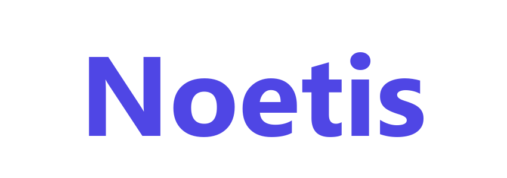

<div align="center">
    
    <h3>Privacy-first AI meeting assistant</h3>
    <p>Captures, transcribes, and summarizes meetings entirely on your own infrastructure.</p>
</div>

---

## Features

- **Local transcription** — Whisper or Parakeet run on your device. Audio never leaves the machine.
- **Flexible AI summaries** — Built-in on-device model, Ollama, Claude, Groq, OpenRouter, OpenAI, or any
  OpenAI-compatible endpoint (including Azure AI Foundry).
- **Speaker identification** — Click **Speakers** on a meeting to label who said what, on-device. Rename a
  speaker once and it updates across the transcript; rename onto an existing name to merge duplicates.
- **Custom summary templates** — Built-in templates for standups, retros, client calls and more; create and
  edit your own in **Settings → Templates**.
- **Exports** — Summary and transcript to PDF, Word (.docx) or Markdown.
- **Centrally managed** — IT can pin every install to one summary endpoint and an org-wide template library
  with a single policy file. See [Managed Policy](docs/ENTERPRISE_POLICY.md).
- **Professional audio mixing** — Microphone and system audio captured together with ducking and clipping
  prevention.
- **GPU acceleration** — Metal/CoreML on macOS, Vulkan or CUDA on Windows/Linux.
- **Import & re-transcribe** *(beta)* — Transcribe existing audio files or re-run a meeting with another
  model or language.

## Installation

### Windows

1. Download the latest `x64-setup.exe` from this repository's [Releases](../../releases/latest).
2. Run the installer.

> The packaged installer uses a Vulkan-enabled Whisper build and requires an AVX2-capable x64 CPU.
> CUDA acceleration requires a source build with a compatible NVIDIA CUDA toolchain.

### macOS

1. Download the `.dmg` from [Releases](../../releases/latest).
2. Drag **Noetis** to Applications and open it.

### Linux

Build from source: [Building on Linux](docs/building_in_linux.md) · [General build instructions](docs/BUILDING.md).

```bash
cd frontend
pnpm install --frozen-lockfile
./build-gpu.sh
```

## Organization deployment

For a fleet, deploy `policy.json` (Intune, GPO or MDM) to pin summaries to a central model, for example
DeepSeek on Azure AI Foundry, and share templates from a network folder. Full reference:
[docs/ENTERPRISE_POLICY.md](docs/ENTERPRISE_POLICY.md).

## Architecture

Noetis is a single self-contained [Tauri](https://tauri.app/) application: a Rust core handles audio
capture, transcription, storage and summarization; a Next.js frontend provides the UI.
See [docs/architecture.md](docs/architecture.md).

## Development

You need Rust and Node.js (pnpm). See [docs/BUILDING.md](docs/BUILDING.md) and
[CONTRIBUTING.md](CONTRIBUTING.md).

## License

MIT — see [LICENSE.md](LICENSE.md). This project is derived from an MIT-licensed upstream; its original
copyright notice is retained in the license file as the MIT license requires.

## Acknowledgments

- [Whisper.cpp](https://github.com/ggerganov/whisper.cpp), [Screenpipe](https://github.com/mediar-ai/screenpipe)
  and [transcribe-rs](https://crates.io/crates/transcribe-rs), from which some code is borrowed.
- **NVIDIA** for the **Parakeet** model, and [istupakov](https://huggingface.co/istupakov/parakeet-tdt-0.6b-v3-onnx)
  for its ONNX conversion.
- [WeSpeaker](https://github.com/wenet-e2e/wespeaker) for the ResNet34 speaker-embedding model used by speaker
  identification ([Apache-2.0](https://huggingface.co/Wespeaker/wespeaker-voxceleb-resnet34)).
- The optional built-in summarization models are third-party GGUF quantizations under their own licenses —
  review before enabling one:
  - [Qwen3.5](https://huggingface.co/unsloth/Qwen3.5-2B-Instruct-GGUF) (quantized by [unsloth](https://huggingface.co/unsloth)) — Alibaba's [Qwen License](https://huggingface.co/Qwen/Qwen3.5-2B-Instruct/blob/main/LICENSE).
  - [Gemma 3](https://huggingface.co/bartowski/google_gemma-3-4b-it-GGUF) (quantized by [bartowski](https://huggingface.co/bartowski)) — Google's [Gemma Terms of Use](https://ai.google.dev/gemma/terms), which include usage restrictions beyond a standard open-source license.
